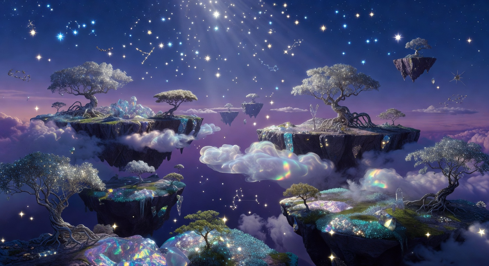

# 🌙 DreamScape AI

**Unlock the Mysteries of Your Subconscious Mind**

A mystical, interactive dream interpretation web application powered by AI. Built with **Claude 4.5 Sonnet** (code) and **xAI Grok** (images).



## 🌐 Live Demo

**Try it now:** [https://japanclassicstore-cyber.github.io/dreamscape-ai](https://japanclassicstore-cyber.github.io/dreamscape-ai)

## ✨ Features

- 🔮 **AI Dream Interpretation** - Advanced algorithm analyzes your dream symbolism
- 🎨 **Beautiful Visualizations** - AI-generated mystical artwork
- 🎵 **Sound Wave Animation** - Mesmerizing analysis visualization
- 🔐 **Dream Symbol Dictionary** - 8 common symbols with meanings
- 📱 **Social Sharing** - Share your interpretation on Twitter/Facebook
- 🌟 **Interactive Elements** - Hover effects, animations, glassmorphism design
- 📱 **Mobile Responsive** - Works perfectly on all devices

## 🚀 Technologies

- **AI Code Generation:** Claude 4.5 Sonnet (via Segmind API)
- **AI Image Generation:** xAI Grok API
- **Frontend:** HTML5, CSS3, JavaScript (Vanilla)
- **Design:** Glassmorphism, Purple/Blue/Gold palette
- **Fonts:** Cinzel, Raleway (Google Fonts)
- **Hosting:** GitHub Pages

## 🎨 AI-Generated Images

| Image | Description |
|-------|-------------|
| `dreamscape-bg.jpg` | Mystical dreamscape background |
| `interpreter.jpg` | Dream interpreter character |
| `dream-visual.jpg` | Abstract dream visualization |
| `moon-dream.jpg` | Mystical moon symbolism |
| `dream-portal.jpg` | Lucid dreaming portal |

## 📝 Dream Symbols Covered

- 💧 Water - Emotions & cleansing
- 🕊️ Flying - Freedom & transcendence
- 🌊 Falling - Loss of control
- 🐺 Animals - Instincts & desires
- 🏠 Houses - Self & personality
- 🌙 Moon - Intuition & femininity
- 🔑 Keys - Opportunities
- 🌺 Flowers - Growth & beauty

## 🎨 Design Features

- Animated starfield background
- Sound wave visualization during analysis
- Smooth scroll animations
- Glassmorphism cards with hover effects
- Gradient text and glowing elements
- Parallax scrolling effects
- Typewriter animation for subtitle

## 📁 Project Structure

```
dreamscape-ai/
├── index.html          # Main application (Claude 4.5 generated)
├── images/
│   ├── dreamscape-bg.jpg
│   ├── interpreter.jpg
│   ├── dream-visual.jpg
│   ├── moon-dream.jpg
│   └── dream-portal.jpg
└── README.md
```

## 🎯 Why It Could Go Viral

1. **Universal Appeal** - Everyone has dreams
2. **Mystical Aesthetic** - Visually captivating
3. **Shareable Results** - Social media integration
4. **AI-Powered** - Modern tech appeal
5. **Interactive** - Engaging user experience

## 📝 License

MIT License - Free to use and modify!

## 🙏 Credits

- **Code:** Generated by Claude 4.5 Sonnet
- **Images:** Generated by xAI Grok
- **Inspiration:** The mysterious world of dreams

---

**Made with 🌙 and AI magic**
